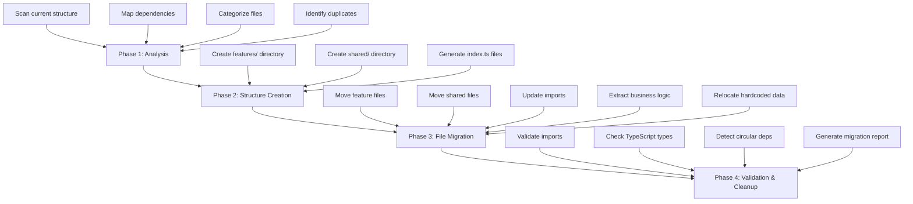
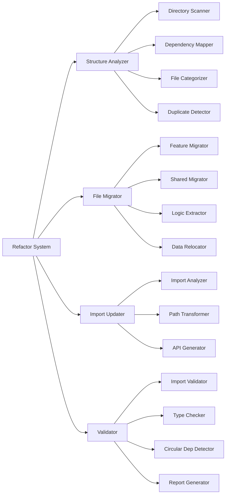

# Design Document: Feature-Based Architecture Refactor

## Overview

This design document outlines the technical approach for refactoring the current project from a type-based folder structure to a feature-based architecture. The refactoring system will automate the reorganization of code, update import paths, consolidate duplicates, and ensure the refactored codebase maintains full functionality.

The refactoring addresses several critical issues in the current codebase:
- Duplicate folders (section/sections, visa/visa-detail)
- Inconsistent naming conventions (kebab-case vs PascalCase)
- Mixed concerns (business logic embedded in UI components)
- Scattered feature-specific code across multiple directories
- Lack of clear module boundaries and public APIs

The target architecture organizes code by business features (visa, blog, tools, landing) with isolated modules containing their own components, hooks, utilities, and types. Truly shared code is centralized in a shared folder with clear public APIs via index.ts exports.

## Architecture

### High-Level Structure

The refactored architecture follows a feature-based organization pattern:

```
project-root/
├── app/                    # Next.js App Router (unchanged)
│   ├── blog/
│   ├── tools/
│   ├── visa/
│   ├── layout.tsx
│   └── page.tsx
├── features/               # Feature modules (NEW)
│   ├── visa/
│   │   ├── components/
│   │   ├── hooks/
│   │   ├── lib/
│   │   ├── types/
│   │   ├── utils/
│   │   └── index.ts
│   ├── blog/
│   │   ├── components/
│   │   ├── hooks/
│   │   ├── lib/
│   │   ├── types/
│   │   ├── utils/
│   │   └── index.ts
│   ├── tools/
│   │   ├── components/
│   │   ├── hooks/
│   │   ├── lib/
│   │   ├── types/
│   │   ├── utils/
│   │   └── index.ts
│   └── landing/
│       ├── components/
│       ├── hooks/
│       ├── lib/
│       ├── types/
│       ├── utils/
│       └── index.ts
├── shared/                 # Shared modules (NEW)
│   ├── ui/
│   │   └── index.ts
│   ├── layout/
│   │   └── index.ts
│   ├── hooks/
│   │   └── index.ts
│   ├── utils/
│   │   └── index.ts
│   ├── types/
│   │   └── index.ts
│   └── lib/
│       └── index.ts
├── components/             # DEPRECATED (to be removed)
├── hooks/                  # DEPRECATED (to be removed)
├── lib/                    # DEPRECATED (to be removed)
└── utils/                  # DEPRECATED (to be removed)
```

### Architecture Principles

1. **Feature Isolation**: Each feature module is self-contained with its own components, hooks, utilities, and types
2. **Clear Boundaries**: Public APIs defined via index.ts exports prevent internal implementation leakage
3. **Shared by Exception**: Code is only shared when genuinely reusable across multiple features
4. **Consistent Structure**: All feature modules follow the same internal organization pattern
5. **Import Clarity**: All imports use module entry points (index.ts) rather than deep file paths

### Migration Phases

The refactoring will be executed in four phases:



## Components and Interfaces

### Refactor System Architecture



### Core Components

#### 1. Structure Analyzer

**Responsibility**: Analyze the current codebase structure and build a migration plan

**Interface**:
```typescript
interface StructureAnalyzer {
  scanDirectories(paths: string[]): FileNode[];
  mapDependencies(files: FileNode[]): DependencyGraph;
  categorizeFiles(files: FileNode[]): FileCategorization;
  detectDuplicates(files: FileNode[]): DuplicateGroup[];
}

interface FileNode {
  path: string;
  type: 'component' | 'hook' | 'util' | 'type' | 'lib';
  imports: string[];
  exports: string[];
  feature?: 'visa' | 'blog' | 'tools' | 'landing' | 'shared';
}

interface DependencyGraph {
  nodes: Map<string, FileNode>;
  edges: Map<string, string[]>;
}

interface FileCategorization {
  visa: FileNode[];
  blog: FileNode[];
  tools: FileNode[];
  landing: FileNode[];
  shared: FileNode[];
}

interface DuplicateGroup {
  files: FileNode[];
  similarity: number;
  recommendedAction: 'merge' | 'keep-both' | 'rename';
}
```

#### 2. File Migrator

**Responsibility**: Move files to their new locations while preserving git history

**Interface**:
```typescript
interface FileMigrator {
  migrateFeatureFiles(categorization: FileCategorization): MigrationResult;
  migrateSharedFiles(files: FileNode[]): MigrationResult;
  extractBusinessLogic(component: FileNode): ExtractionResult;
  relocateHardcodedData(component: FileNode): RelocationResult;
}

interface MigrationResult {
  movedFiles: Array<{ from: string; to: string }>;
  errors: Array<{ file: string; error: string }>;
  warnings: Array<{ file: string; warning: string }>;
}

interface ExtractionResult {
  originalFile: string;
  extractedFiles: Array<{ path: string; content: string }>;
  updatedComponent: string;
}

interface RelocationResult {
  originalFile: string;
  dataFile: string;
  updatedComponent: string;
}
```

#### 3. Import Updater

**Responsibility**: Update all import paths to reflect new file locations

**Interface**:
```typescript
interface ImportUpdater {
  analyzeImports(file: FileNode): ImportAnalysis;
  transformPaths(analysis: ImportAnalysis, newLocation: string): PathTransformation;
  generatePublicAPI(module: string, files: FileNode[]): string;
  updateAllImports(migrations: MigrationResult): UpdateResult;
}

interface ImportAnalysis {
  file: string;
  imports: Array<{
    source: string;
    specifiers: string[];
    isRelative: boolean;
    isExternal: boolean;
  }>;
}

interface PathTransformation {
  file: string;
  transformations: Array<{
    oldImport: string;
    newImport: string;
    reason: string;
  }>;
}

interface UpdateResult {
  updatedFiles: string[];
  errors: Array<{ file: string; error: string }>;
}
```

#### 4. Migration Validator

**Responsibility**: Validate the refactored codebase maintains functionality

**Interface**:
```typescript
interface MigrationValidator {
  validateImports(files: string[]): ValidationResult;
  checkTypeResolution(files: string[]): ValidationResult;
  detectCircularDependencies(graph: DependencyGraph): CircularDepResult;
  validatePublicAPIs(modules: string[]): ValidationResult;
  generateReport(results: ValidationResult[]): MigrationReport;
}

interface ValidationResult {
  passed: boolean;
  errors: Array<{ file: string; line: number; message: string }>;
  warnings: Array<{ file: string; line: number; message: string }>;
}

interface CircularDepResult {
  found: boolean;
  cycles: Array<string[]>;
}

interface MigrationReport {
  summary: {
    totalFiles: number;
    movedFiles: number;
    updatedImports: number;
    errors: number;
    warnings: number;
  };
  fileMapping: Array<{ from: string; to: string }>;
  breakingChanges: string[];
  manualSteps: string[];
}
```

## Data Models

### File Mapping Configuration

The refactoring system uses a configuration-driven approach to map files from old to new locations:

```typescript
interface MigrationConfig {
  features: FeatureMapping[];
  shared: SharedMapping;
  namingConventions: NamingRules;
  duplicateResolution: DuplicateRules;
}

interface FeatureMapping {
  name: 'visa' | 'blog' | 'tools' | 'landing';
  patterns: string[];  // Glob patterns to match files
  targetDir: string;
  subdirs: {
    components: string[];
    hooks: string[];
    lib: string[];
    types: string[];
    utils: string[];
  };
}

interface SharedMapping {
  ui: string[];
  layout: string[];
  hooks: string[];
  utils: string[];
  types: string[];
  lib: string[];
}

interface NamingRules {
  directories: 'kebab-case';
  components: 'PascalCase';
  hooks: 'camelCase';
  utils: 'camelCase';
  types: 'PascalCase';
}

interface DuplicateRules {
  strategy: 'merge' | 'keep-both' | 'prompt';
  similarityThreshold: number;
  conflictResolution: 'newest' | 'largest' | 'manual';
}
```

### File Mapping Table

| Current Location | New Location | Category | Notes |
|-----------------|--------------|----------|-------|
| `components/visa/*` | `features/visa/components/*` | Feature | Visa-specific components |
| `components/visa-detail/*` | `features/visa/components/*` | Feature | Merge with visa components |
| `components/blog/*` | `features/blog/components/*` | Feature | Blog-specific components |
| `components/tools/*` | `features/tools/components/*` | Feature | Tools-specific components |
| `components/section/*` | `features/landing/components/*` | Feature | Landing page sections |
| `components/sections/*` | `features/landing/components/*` | Feature | Merge with section |
| `components/ui/*` | `shared/ui/*` | Shared | Reusable UI components |
| `components/layout/*` | `shared/layout/*` | Shared | Layout components |
| `hooks/useQuizState.ts` | `features/visa/hooks/useQuizState.ts` | Feature | Visa quiz hook |
| `hooks/useSponsorLetterState.ts` | `features/visa/hooks/useSponsorLetterState.ts` | Feature | Visa sponsor hook |
| `hooks/useCompareState.ts` | `features/tools/hooks/useCompareState.ts` | Feature | Tools compare hook |
| `hooks/useDebounce.ts` | `shared/hooks/useDebounce.ts` | Shared | Generic utility hook |
| `hooks/useReducedMotion.ts` | `shared/hooks/useReducedMotion.ts` | Shared | Generic utility hook |
| `lib/visa-data.ts` | `features/visa/lib/data.ts` | Feature | Visa data |
| `lib/tools/*` | `features/tools/lib/*` | Feature | Tools utilities |
| `lib/utils.ts` | `shared/utils/cn.ts` | Shared | Shared utilities |
| `utils/animations.ts` | `shared/utils/animations.ts` | Shared | Animation utilities |
| `utils/useAnimationConfig.ts` | `shared/hooks/useAnimationConfig.ts` | Shared | Animation hook |
| `utils/validation.ts` | `shared/utils/validation.ts` | Shared | Validation utilities |

### Import Path Transformation Rules

```typescript
interface ImportTransformRule {
  pattern: RegExp;
  replacement: string;
  condition?: (file: string) => boolean;
}

const transformRules: ImportTransformRule[] = [
  // Feature imports
  {
    pattern: /^@\/components\/visa(-detail)?\//,
    replacement: '@/features/visa/components/',
  },
  {
    pattern: /^@\/components\/blog\//,
    replacement: '@/features/blog/components/',
  },
  {
    pattern: /^@\/components\/tools\//,
    replacement: '@/features/tools/components/',
  },
  {
    pattern: /^@\/components\/sections?\//,
    replacement: '@/features/landing/components/',
  },
  
  // Shared imports
  {
    pattern: /^@\/components\/ui\//,
    replacement: '@/shared/ui/',
  },
  {
    pattern: /^@\/components\/layout\//,
    replacement: '@/shared/layout/',
  },
  {
    pattern: /^@\/hooks\/(useDebounce|useReducedMotion)/,
    replacement: '@/shared/hooks/$1',
  },
  {
    pattern: /^@\/lib\/utils$/,
    replacement: '@/shared/utils',
  },
  {
    pattern: /^@\/utils\//,
    replacement: '@/shared/utils/',
  },
  
  // Feature-specific hooks
  {
    pattern: /^@\/hooks\/(useQuizState|useSponsorLetterState)/,
    replacement: '@/features/visa/hooks/$1',
  },
  {
    pattern: /^@\/hooks\/useCompareState/,
    replacement: '@/features/tools/hooks/useCompareState',
  },
  
  // Feature-specific lib
  {
    pattern: /^@\/lib\/visa-data/,
    replacement: '@/features/visa/lib/data',
  },
  {
    pattern: /^@\/lib\/tools\//,
    replacement: '@/features/tools/lib/',
  },
];
```


## Correctness Properties

*A property is a characteristic or behavior that should hold true across all valid executions of a system-essentially, a formal statement about what the system should do. Properties serve as the bridge between human-readable specifications and machine-verifiable correctness guarantees.*

### Property 1: Complete Directory Scanning

*For any* project structure with components/, hooks/, lib/, and utils/ directories, the Structure Analyzer should discover all files and subdirectories within these locations.

**Validates: Requirements 1.1**

### Property 2: Duplicate Folder Detection

*For any* file system containing folders with similar names (e.g., "section" and "sections", "visa" and "visa-detail"), the Duplicate Resolver should identify them as potential duplicates.

**Validates: Requirements 1.2**

### Property 3: Naming Convention Detection

*For any* file or directory name, the Structure Analyzer should correctly identify whether it follows kebab-case, PascalCase, or camelCase conventions.

**Validates: Requirements 1.3**

### Property 4: Complete Dependency Mapping

*For any* file containing import statements, the Structure Analyzer should map all dependencies to create a complete dependency graph with no missing edges.

**Validates: Requirements 1.4**

### Property 5: Correct File Categorization

*For any* file in the project, the Structure Analyzer should categorize it into exactly one feature domain (visa, blog, tools, landing, or shared) based on its path, name, and import patterns.

**Validates: Requirements 1.5, 3.1, 3.2, 3.3, 3.4**

### Property 6: Hardcoded Data Detection

*For any* component file containing object or array literals above a size threshold, the Structure Analyzer should identify them as hardcoded data requiring extraction.

**Validates: Requirements 1.6**

### Property 7: Feature Module Structure Consistency

*For any* feature module created (visa, blog, tools, landing), it should contain the standard subdirectories: components/, hooks/, lib/, types/, and utils/.

**Validates: Requirements 2.3**

### Property 8: App Directory Preservation

*For any* refactoring operation, the app/ directory structure should remain identical before and after the migration (same files, same locations, same content).

**Validates: Requirements 2.7**

### Property 9: Multi-Use Component Sharing

*For any* component that is imported by files in two or more different feature domains, it should be placed in shared/ui/ rather than any feature-specific directory.

**Validates: Requirements 4.6**

### Property 10: Multi-Use Hook Sharing

*For any* hook that is imported by files in two or more different feature domains, it should be placed in shared/hooks/ rather than any feature-specific directory.

**Validates: Requirements 4.7**

### Property 11: Duplicate File Consolidation

*For any* set of duplicate or highly similar files (similarity > threshold), they should be consolidated into a single location with all import references updated to point to the consolidated file.

**Validates: Requirements 5.2, 5.3, 5.5**

### Property 12: Conflict Preservation

*For any* pair of duplicate files with conflicting implementations (different functionality), both files should be preserved with distinct, descriptive names.

**Validates: Requirements 5.4**

### Property 13: Naming Convention Compliance

*For any* file or directory after refactoring, it should follow the appropriate naming convention: kebab-case for directories, PascalCase for React components, camelCase for hooks and utilities.

**Validates: Requirements 6.1, 6.2, 6.3, 6.4**

### Property 14: Import Update Completeness

*For any* file that is moved or renamed, all files that import it should have their import statements updated to reflect the new location.

**Validates: Requirements 6.5, 7.1**

### Property 15: Import Path Correctness

*For any* import statement after refactoring, the import path should correctly resolve to the target file using the appropriate relative path depth or public API export.

**Validates: Requirements 7.2, 7.3, 7.6**

### Property 16: External Import Preservation

*For any* import statement that references an external package (node_modules), it should remain unchanged after refactoring.

**Validates: Requirements 7.4**

### Property 17: Dynamic Import Updates

*For any* dynamic import or lazy-loaded component, the import path should be correctly updated to reflect new file locations.

**Validates: Requirements 7.5**

### Property 18: Public API Index Files

*For any* feature module or shared module subdirectory, it should contain an index.ts file that exports the public API.

**Validates: Requirements 2.6, 8.1, 8.2**

### Property 19: Public API Export Completeness

*For any* index.ts file, it should export all public components, hooks, utilities, and types from its module, using named exports.

**Validates: Requirements 8.3, 8.4**

### Property 20: Public API Documentation

*For any* exported item in an index.ts file, it should have a JSDoc comment describing its purpose.

**Validates: Requirements 8.5**

### Property 21: Private Implementation Exclusion

*For any* file or function with a name indicating private implementation (e.g., starting with underscore or in a "internal" directory), it should not be exported in the public API index.ts.

**Validates: Requirements 8.6**

### Property 22: API Call Extraction

*For any* component file containing fetch() calls, axios calls, or other HTTP client invocations, these should be extracted to a separate file in the lib/ directory.

**Validates: Requirements 9.4**

### Property 23: Behavioral Equivalence After Extraction

*For any* component that has logic extracted, the component's external behavior (props in, rendered output out) should remain identical before and after extraction.

**Validates: Requirements 9.6**

### Property 24: Hardcoded Data Extraction

*For any* component containing object or array literals above a size threshold, these should be extracted to lib/data.ts or lib/constants.ts.

**Validates: Requirements 10.1**

### Property 25: Data Location by Scope

*For any* extracted data, it should be placed in the feature's lib/ directory if used only by that feature, or in shared/lib/ if used by multiple features.

**Validates: Requirements 10.5, 10.6**

### Property 26: File Migration Completeness

*For any* file in the source structure (components/, hooks/, lib/, utils/), it should exist in the target structure (features/ or shared/) after migration.

**Validates: Requirements 11.1**

### Property 27: Import Resolution Validity

*For any* import statement after migration, it should successfully resolve to an existing file without errors.

**Validates: Requirements 11.2**

### Property 28: TypeScript Type Resolution

*For any* TypeScript file after migration, all type references should resolve correctly without type errors.

**Validates: Requirements 11.3**

### Property 29: Circular Dependency Prevention

*For any* dependency graph after migration, it should contain no circular dependencies (no cycles in the graph).

**Validates: Requirements 11.4**

### Property 30: Public API Accessibility

*For any* public API export defined in an index.ts file, it should be importable from other modules without errors.

**Validates: Requirements 11.5**

### Property 31: Validation Error Reporting

*For any* validation error detected, the error report should include the specific file path and line number where the error occurs.

**Validates: Requirements 11.6**

### Property 32: Migration Report Generation

*For any* completed migration, a report should be generated containing: total files moved, updated imports count, errors, warnings, and file mapping table.

**Validates: Requirements 11.7**

### Property 33: Git History Preservation

*For any* file move operation, the system should use `git mv` command to preserve file history, allowing `git log --follow` to track the file's evolution.

**Validates: Requirements 12.1, 12.4**

### Property 34: Logical Commit Grouping

*For any* migration execution, changes should be committed in logical groups (e.g., all visa files moved together, all import updates together) rather than as a single monolithic commit.

**Validates: Requirements 12.2**

### Property 35: Migration Documentation Completeness

*For any* completed migration, the MIGRATION.md file should contain: before/after structure comparison, import pattern examples, file mapping table, and breaking changes list.

**Validates: Requirements 13.1, 13.2, 13.3, 13.4, 13.5, 13.6**

## Error Handling

### Error Categories

The refactoring system must handle several categories of errors:

1. **File System Errors**
   - Missing directories or files
   - Permission denied errors
   - Disk space issues
   - File locks or concurrent access

2. **Parse Errors**
   - Invalid TypeScript/JavaScript syntax
   - Malformed import statements
   - Unparseable JSX

3. **Dependency Errors**
   - Circular dependencies
   - Missing imports
   - Ambiguous module resolution

4. **Validation Errors**
   - Type errors after migration
   - Broken imports
   - Missing exports

5. **Git Errors**
   - Uncommitted changes blocking migration
   - Merge conflicts
   - Git command failures

### Error Handling Strategy

```typescript
interface ErrorHandler {
  handleError(error: RefactorError): ErrorResolution;
  canRecover(error: RefactorError): boolean;
  rollback(checkpoint: MigrationCheckpoint): void;
}

interface RefactorError {
  category: ErrorCategory;
  severity: 'fatal' | 'error' | 'warning';
  message: string;
  file?: string;
  line?: number;
  recoverable: boolean;
}

interface ErrorResolution {
  action: 'abort' | 'skip' | 'retry' | 'manual';
  message: string;
  suggestedFix?: string;
}

type ErrorCategory = 
  | 'file-system'
  | 'parse'
  | 'dependency'
  | 'validation'
  | 'git';
```

### Error Recovery Mechanisms

1. **Checkpointing**: Create checkpoints before each major phase
2. **Rollback**: Ability to revert to any checkpoint
3. **Partial Migration**: Continue with successful parts if some files fail
4. **Manual Intervention**: Pause and request user input for ambiguous cases
5. **Dry Run Mode**: Validate migration plan without making changes

### Error Reporting

All errors should be reported with:
- Clear, actionable error messages
- File path and line number (when applicable)
- Suggested fixes or next steps
- Severity level (fatal, error, warning)
- Stack trace for debugging (in verbose mode)

Example error output:
```
ERROR [dependency]: Circular dependency detected
  Files involved:
    - features/visa/components/VisaCard.tsx
    - features/visa/hooks/useVisaData.ts
    - features/visa/lib/visaHelpers.ts
  
  Suggested fix: Extract shared types to features/visa/types/
  
  Action: Migration paused. Please resolve circular dependency and retry.
```

## Testing Strategy

### Dual Testing Approach

The refactoring system requires both unit tests and property-based tests for comprehensive coverage:

- **Unit tests**: Verify specific examples, edge cases, and error conditions
- **Property tests**: Verify universal properties across all inputs

### Unit Testing Focus

Unit tests should cover:

1. **Specific File Mappings**: Test that known files (e.g., components/visa/VisaCard.tsx) map to expected locations
2. **Edge Cases**: Empty directories, files with no imports, circular dependencies
3. **Error Conditions**: Missing files, permission errors, invalid syntax
4. **Integration Points**: Git command execution, file system operations, TypeScript compiler integration
5. **Duplicate Resolution**: Specific examples like section/sections merge

Example unit tests:
```typescript
describe('File Migrator', () => {
  it('should move components/visa/VisaCard.tsx to features/visa/components/VisaCard.tsx', () => {
    // Test specific file migration
  });
  
  it('should handle missing source file gracefully', () => {
    // Test error handling
  });
  
  it('should merge section and sections folders', () => {
    // Test specific duplicate resolution
  });
});
```

### Property-Based Testing Focus

Property tests should verify universal properties across randomized inputs. Each test should run a minimum of 100 iterations.

**Property Test Configuration**:
- Library: fast-check (for TypeScript/JavaScript)
- Iterations: 100 minimum per test
- Shrinking: Enabled to find minimal failing cases
- Seed: Configurable for reproducibility

**Test Tagging Format**:
Each property test must include a comment tag referencing the design property:
```typescript
// Feature: feature-based-refactor, Property 1: Complete Directory Scanning
```

Example property tests:

```typescript
import fc from 'fast-check';

// Feature: feature-based-refactor, Property 1: Complete Directory Scanning
describe('Property 1: Complete Directory Scanning', () => {
  it('should discover all files in target directories', () => {
    fc.assert(
      fc.property(
        fc.array(fc.string()), // Generate random file paths
        (filePaths) => {
          const mockFS = createMockFileSystem(filePaths);
          const analyzer = new StructureAnalyzer(mockFS);
          const discovered = analyzer.scanDirectories(['components', 'hooks', 'lib', 'utils']);
          
          // All files should be discovered
          return filePaths.every(path => 
            discovered.some(node => node.path === path)
          );
        }
      ),
      { numRuns: 100 }
    );
  });
});

// Feature: feature-based-refactor, Property 5: Correct File Categorization
describe('Property 5: Correct File Categorization', () => {
  it('should categorize files into exactly one domain', () => {
    fc.assert(
      fc.property(
        fc.array(fileNodeArbitrary()), // Generate random file nodes
        (files) => {
          const analyzer = new StructureAnalyzer();
          const categorization = analyzer.categorizeFiles(files);
          
          // Each file should appear in exactly one category
          const allCategorized = [
            ...categorization.visa,
            ...categorization.blog,
            ...categorization.tools,
            ...categorization.landing,
            ...categorization.shared
          ];
          
          return allCategorized.length === files.length &&
                 new Set(allCategorized.map(f => f.path)).size === files.length;
        }
      ),
      { numRuns: 100 }
    );
  });
});

// Feature: feature-based-refactor, Property 15: Import Path Correctness
describe('Property 15: Import Path Correctness', () => {
  it('should generate correct relative paths between any two files', () => {
    fc.assert(
      fc.property(
        fc.tuple(fc.string(), fc.string()), // Generate random file paths
        ([sourcePath, targetPath]) => {
          const updater = new ImportUpdater();
          const relativePath = updater.calculateRelativePath(sourcePath, targetPath);
          
          // Relative path should correctly resolve to target
          const resolved = path.resolve(path.dirname(sourcePath), relativePath);
          return path.normalize(resolved) === path.normalize(targetPath);
        }
      ),
      { numRuns: 100 }
    );
  });
});

// Feature: feature-based-refactor, Property 29: Circular Dependency Prevention
describe('Property 29: Circular Dependency Prevention', () => {
  it('should detect any cycles in dependency graph', () => {
    fc.assert(
      fc.property(
        dependencyGraphArbitrary(), // Generate random dependency graphs
        (graph) => {
          const validator = new MigrationValidator();
          const result = validator.detectCircularDependencies(graph);
          
          // If cycles exist, they should be detected
          const actualCycles = findCyclesBruteForce(graph);
          return result.found === (actualCycles.length > 0);
        }
      ),
      { numRuns: 100 }
    );
  });
});
```

### Test Data Generators

For property-based testing, we need generators (arbitraries) for domain objects:

```typescript
// Generate random file nodes
const fileNodeArbitrary = () => fc.record({
  path: fc.string(),
  type: fc.constantFrom('component', 'hook', 'util', 'type', 'lib'),
  imports: fc.array(fc.string()),
  exports: fc.array(fc.string()),
  feature: fc.option(fc.constantFrom('visa', 'blog', 'tools', 'landing', 'shared'))
});

// Generate random dependency graphs
const dependencyGraphArbitrary = () => fc.record({
  nodes: fc.dictionary(fc.string(), fileNodeArbitrary()),
  edges: fc.dictionary(fc.string(), fc.array(fc.string()))
});

// Generate random file systems
const fileSystemArbitrary = () => fc.array(
  fc.record({
    path: fc.string(),
    content: fc.string(),
    isDirectory: fc.boolean()
  })
);
```

### Integration Testing

Integration tests should verify:
1. End-to-end migration of a sample project
2. Git history preservation
3. TypeScript compilation after migration
4. Import resolution in a real Node.js environment

### Validation Testing

After migration, run:
1. TypeScript compiler (`tsc --noEmit`)
2. ESLint for code quality
3. Existing test suite to ensure functionality preserved
4. Build process to ensure production readiness

## Migration Strategy and Phases

### Phase 1: Analysis and Planning

**Objective**: Understand the current structure and create a migration plan

**Steps**:
1. Scan all target directories (components/, hooks/, lib/, utils/)
2. Parse all files to extract imports and exports
3. Build dependency graph
4. Categorize files by feature domain
5. Identify duplicates and naming inconsistencies
6. Detect hardcoded data and business logic in components
7. Generate migration plan with file mappings

**Output**: Migration plan JSON file with all file movements and transformations

**Duration**: ~5-10 minutes for medium-sized project

### Phase 2: Structure Creation

**Objective**: Create the new directory structure

**Steps**:
1. Create features/ directory
2. Create feature subdirectories (visa/, blog/, tools/, landing/)
3. Create standard subdirectories in each feature (components/, hooks/, lib/, types/, utils/)
4. Create shared/ directory
5. Create shared subdirectories (ui/, layout/, hooks/, utils/, types/, lib/)
6. Generate index.ts files for all modules

**Output**: Empty directory structure ready for migration

**Duration**: < 1 minute

### Phase 3: File Migration

**Objective**: Move files to new locations and update imports

**Steps**:
1. **Checkpoint**: Create git checkpoint before migration
2. **Move Feature Files**: 
   - Move visa files to features/visa/
   - Move blog files to features/blog/
   - Move tools files to features/tools/
   - Move landing files to features/landing/
   - Use `git mv` for each file
   - Commit after each feature: "Move {feature} files"
3. **Move Shared Files**:
   - Move UI components to shared/ui/
   - Move layout components to shared/layout/
   - Move shared hooks to shared/hooks/
   - Move utilities to shared/utils/
   - Use `git mv` for each file
   - Commit: "Move shared files"
4. **Resolve Duplicates**:
   - Merge section/sections folders
   - Merge visa/visa-detail folders
   - Update all import references
   - Commit: "Resolve duplicate folders"
5. **Update Imports**:
   - Update all import paths to reflect new locations
   - Convert to public API imports where appropriate
   - Commit: "Update import paths"
6. **Extract Business Logic**:
   - Extract API calls from components
   - Extract hardcoded data
   - Commit: "Extract business logic and data"
7. **Standardize Naming**:
   - Rename files to follow conventions
   - Update imports for renamed files
   - Commit: "Standardize naming conventions"

**Output**: Fully migrated codebase with updated imports

**Duration**: ~10-20 minutes for medium-sized project

### Phase 4: Validation and Cleanup

**Objective**: Verify migration success and clean up

**Steps**:
1. **Validate Imports**: Check all imports resolve correctly
2. **Type Check**: Run TypeScript compiler
3. **Detect Circular Dependencies**: Analyze dependency graph
4. **Validate Public APIs**: Test all exports are accessible
5. **Run Tests**: Execute existing test suite
6. **Generate Report**: Create MIGRATION.md with all changes
7. **Cleanup**: Remove old empty directories
8. **Final Commit**: "Complete feature-based refactor"

**Output**: Validated, working codebase with migration documentation

**Duration**: ~5-10 minutes

### Rollback Strategy

If migration fails at any point:

1. **Automatic Rollback**: Revert to last checkpoint using git
2. **Partial Rollback**: Keep successful parts, revert failed parts
3. **Manual Intervention**: Pause and allow manual fixes before continuing

**Rollback Commands**:
```bash
# Rollback to checkpoint
git reset --hard <checkpoint-sha>

# Rollback specific files
git checkout <checkpoint-sha> -- <file-path>

# Abort migration
npm run refactor:abort
```

### Migration Execution

**Dry Run Mode** (recommended first):
```bash
npm run refactor:dry-run
```
- Analyzes structure
- Generates migration plan
- Shows what would be changed
- No actual file modifications

**Full Migration**:
```bash
npm run refactor:migrate
```
- Executes full migration
- Creates checkpoints
- Commits changes in phases
- Generates report

**Interactive Mode**:
```bash
npm run refactor:interactive
```
- Prompts for confirmation at each phase
- Allows manual review of changes
- Option to skip or modify steps

### Post-Migration Tasks

After successful migration:

1. **Update Documentation**: Update README with new structure
2. **Update CI/CD**: Adjust build scripts if needed
3. **Team Communication**: Share MIGRATION.md with team
4. **Monitor**: Watch for any issues in development
5. **Cleanup**: Remove old documentation referencing old structure

## Validation and Testing Approach

### Pre-Migration Validation

Before starting migration:
1. Ensure git working directory is clean
2. Verify all tests pass
3. Check TypeScript compiles without errors
4. Create backup branch

### During Migration Validation

At each checkpoint:
1. Verify files moved successfully
2. Check imports resolve
3. Run quick smoke tests

### Post-Migration Validation

After migration completes:
1. **Import Resolution**: Verify all imports resolve correctly
2. **Type Checking**: Run `tsc --noEmit` to check types
3. **Circular Dependencies**: Analyze dependency graph for cycles
4. **Public API Access**: Test importing from all index.ts files
5. **Test Suite**: Run full test suite
6. **Build**: Execute production build
7. **Lint**: Run ESLint to catch issues

### Validation Report

Generate comprehensive validation report:

```markdown
# Migration Validation Report

## Summary
- Total Files: 150
- Files Moved: 145
- Files Skipped: 5
- Import Updates: 423
- Errors: 0
- Warnings: 3

## Import Validation
✓ All imports resolve correctly
✓ No broken imports detected

## Type Checking
✓ TypeScript compilation successful
✓ No type errors

## Dependency Analysis
✓ No circular dependencies detected
✓ Dependency graph is acyclic

## Test Results
✓ All 87 tests passing
✓ No test failures

## Warnings
⚠ 3 files contain TODO comments for manual review
  - features/visa/components/VisaCard.tsx:45
  - features/blog/lib/api.ts:12
  - shared/utils/validation.ts:78

## Next Steps
1. Review warnings and TODO comments
2. Update team documentation
3. Deploy to staging for integration testing
```

